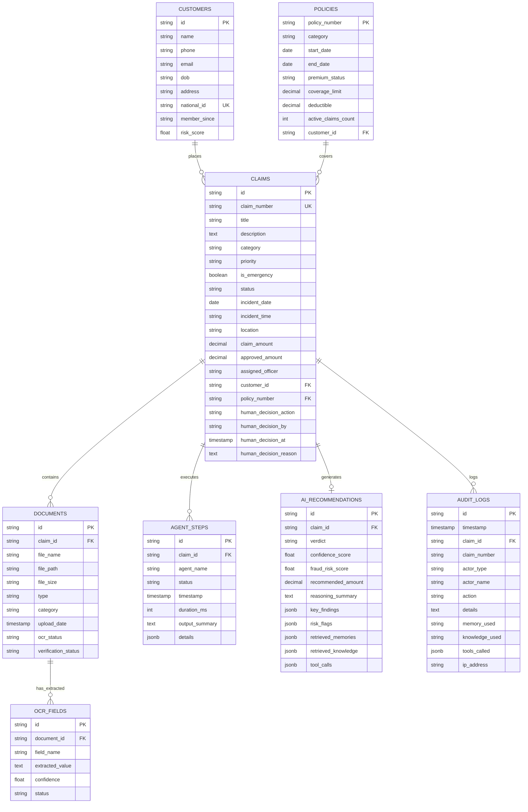

# Insurance Claim Support AI Agent - Backend Architecture & Implementation Plan

## Architectural Overview
This document presents the complete backend architecture, database schema, API design, frontend-backend mismatch resolutions, and Phase 1 implementation plan for the **Insurance Claim Support AI Agent** backend.

---

## 1. Frontend Inspection Summary
The completed Next.js frontend (`app/`, `components/`, `lib/`, `types/insurance.ts`) provides a comprehensive UI designed for insurance claim officers:
* **Dashboard (`/dashboard`)**: Metric summary cards (Total Claims, Pending Review, Approved, Flagged Fraud Risk), recent claim table, priority alerts.
* **Claim Detail View (`/claims/[id]`)**: Detailed view including customer information, policy details, uploaded claim documents with OCR extraction badges, real-time Agent Step progress timeline, AI Recommendation (Verdict, Confidence, Fraud Risk Score, Payout, Reasoning, Key Findings, Risk Flags, RAG policy matches, LangMem case memories), Human Officer Decision input (Approve, Reject, Request Docs with rationale), and Audit Logs.
* **Manual Claim Intake (`/claims/new`)**: Customer details, Policy details, Claim details, Document uploads with simulated OCR extractions, and AI Orchestration workflow trigger.
* **Copilot Chat (`/copilot`)**: Conversational interface for officers to query claim status, policy terms, and document extractions.
* **Documents Matrix (`/documents`)**: Overview of all claim documents, upload history, OCR status, and verified fields.
* **RAG Knowledge Base (`/knowledge`)**: Browsing policy guidelines, coverage rules, clause search, and document ingestion status.
* **LangMem Memory Explorer (`/memory`)**: Vector memory store containing past resolved claims, similarity scores, outcomes, and tags.
* **Audit Logs (`/audit-logs`)**: Complete event trail filterable by actor type (`Officer` vs `AI Agent`), action, timestamp, IP address, and memory/knowledge used.
* **Analytics (`/analytics`)**: Metrics for claim processing velocity, fraud score distributions, and AI vs Human agreement ratios.

---

## 2. Frontend API Requirements
To power all views seamlessly, the backend must support:
1. **Health & System**: Check system availability and dependency status (DB, Ollama, ChromaDB).
2. **Customer Management**: Fetch and register policyholder records.
3. **Policy Management**: Query coverage rules, limits, deductibles, and active claim counts.
4. **Claim Lifecycle**: Create claims, list with filters/search, retrieve full claim context, submit human officer decisions, and trigger AI agent orchestration workflows.
5. **Document & OCR Services**: File uploads (PDF/Images), document listing, OCR trigger, and field verification.
6. **RAG & Knowledge Base**: Policy clause indexing, semantic search, and document ingestion.
7. **LangMem Case Memory**: Vector search over historic resolved cases and memory indexing.
8. **Copilot Chat**: Conversational AI query endpoint bound to active claim context.
9. **Audit Trail**: Fetch audit logs with filtering by actor type, date range, and claim ID.
10. **Analytics**: Aggregate reporting metrics for processing speed and fraud statistics.

---

## 3. Proposed Backend Folder Structure
A clean, modular FastAPI project structure located in `backend/`:

```
backend/
├── app/
│   ├── api/
│   │   ├── v1/
│   │   │   ├── endpoints/
│   │   │   │   ├── health.py
│   │   │   │   ├── customers.py
│   │   │   │   ├── policies.py
│   │   │   │   ├── claims.py
│   │   │   │   ├── documents.py
│   │   │   │   ├── knowledge.py
│   │   │   │   ├── memory.py
│   │   │   │   ├── copilot.py
│   │   │   │   ├── audit_logs.py
│   │   │   │   └── analytics.py
│   │   │   └── router.py
│   ├── core/
│   │   ├── config.py             # pydantic-settings BaseSettings
│   │   ├── database.py           # Async SQLAlchemy Engine & Session
│   │   ├── logging.py            # Structured logging
│   │   └── exceptions.py         # Custom HTTP exception handlers
│   ├── models/                   # SQLAlchemy ORM Models
│   │   ├── base.py
│   │   ├── customer.py
│   │   ├── policy.py
│   │   ├── claim.py
│   │   ├── document.py
│   │   ├── ocr_field.py
│   │   ├── agent_step.py
│   │   ├── recommendation.py
│   │   ├── audit_log.py
│   │   └── memory_node.py
│   ├── schemas/                  # Pydantic Schemas (CamelCase alias support)
│   │   ├── customer.py
│   │   ├── policy.py
│   │   ├── claim.py
│   │   ├── document.py
│   │   ├── agent_step.py
│   │   ├── recommendation.py
│   │   ├── audit_log.py
│   │   ├── RAG.py
│   │   └── copilot.py
│   ├── db/
│   │   ├── base.py               # Database metadata export for Alembic
│   │   └── init_db.py            # Initial seed data script
│   ├── services/                 # Business logic / CRUD services
│   │   ├── customer_service.py
│   │   ├── policy_service.py
│   │   ├── claim_service.py
│   │   ├── document_service.py
│   │   └── audit_service.py
│   ├── ocr/                      # OCR & Vision processing engines
│   │   ├── engine.py             # OCR engine interface
│   │   └── extractor.py          # Structured extraction logic
│   ├── rag/                      # ChromaDB Vector Store integration
│   │   ├── vector_store.py
│   │   └── retriever.py
│   ├── agents/                   # Agentic AI Layer (LangGraph)
│   │   ├── state.py              # Shared State Schema
│   │   ├── tools.py              # Factual DB access tools
│   │   ├── coordinator.py        # Coordinator Agent graph definition
│   │   ├── document_agent.py
│   │   ├── intake_agent.py
│   │   ├── customer_verification_agent.py
│   │   ├── policy_validation_agent.py
│   │   ├── claim_history_agent.py
│   │   ├── rag_knowledge_agent.py
│   │   ├── memory_agent.py
│   │   ├── fraud_detection_agent.py
│   │   └── recommendation_agent.py
│   └── main.py                   # FastAPI Application Entrypoint
├── tests/
│   ├── conftest.py
│   ├── unit/
│   └── api/
├── alembic/                      # Database migrations
├── alembic.ini
├── pyproject.toml
├── requirements.txt
├── .env.example
└── README.md
```

---

## 4. Database Schema and Relationships (PostgreSQL + SQLAlchemy 2.0)

### Primary Entities & Relationships



---

## 5. Identified Required APIs

| Method | Endpoint | Description | Frontend Page / Context |
|---|---|---|---|
| `GET` | `/api/v1/health` | Service health check | System Monitoring |
| `GET` | `/api/v1/customers` | List / search customers | Claim Form / Search |
| `POST` | `/api/v1/customers` | Create new customer record | Claim Form |
| `GET` | `/api/v1/policies/{policy_number}` | Get policy details | Policy Validation / Claim Form |
| `GET` | `/api/v1/claims` | List claims (filterable by category, status, priority) | `/claims`, `/dashboard` |
| `POST` | `/api/v1/claims` | Create claim intake record | `/claims/new` |
| `GET` | `/api/v1/claims/{id}` | Get full claim detail with nested relations | `/claims/[id]` |
| `PATCH` | `/api/v1/claims/{id}/decision` | Update officer human decision | `/claims/[id]` (Officer Action) |
| `POST` | `/api/v1/claims/{id}/process` | Trigger AI agent orchestration workflow | `/claims/new`, `/claims/[id]` |
| `POST` | `/api/v1/claims/{claim_id}/documents` | Upload claim document (multipart) | `/claims/new`, `/claims/[id]` |
| `GET` | `/api/v1/documents/{document_id}` | Retrieve document file & OCR results | `/documents`, `/claims/[id]` |
| `GET` | `/api/v1/knowledge` | List / search RAG knowledge base | `/knowledge` |
| `POST` | `/api/v1/knowledge/search` | Query RAG policy clauses | AI Agents / RAG |
| `GET` | `/api/v1/memory` | List / search LangMem case memories | `/memory` |
| `POST` | `/api/v1/copilot/chat` | Chat query with context | `/copilot` |
| `GET` | `/api/v1/audit-logs` | List system audit logs | `/audit-logs` |
| `GET` | `/api/v1/analytics/summary` | Get aggregated analytics KPIs | `/analytics` |

---

## 6. Frontend & Backend Mismatch Resolution

1. **Naming Conventions (camelCase vs snake_case)**:
   * *Mismatch*: Frontend uses camelCase (`claimNumber`, `incidentDate`, `agentSteps`, `aiRecommendation`). Python uses snake_case (`claim_number`, `incident_date`, `agent_steps`, `ai_recommendation`).
   * *Resolution*: Configure Pydantic schemas using `alias_generator = to_camel` and `populate_by_name = True`. FastAPI outputs clean camelCase JSON for the frontend while internal Python logic maintains PEP-8 snake_case.

2. **Synchronous Mock Generation vs Asynchronous Orchestration**:
   * *Mismatch*: Frontend currently creates synthetic agent steps in memory. Real agent orchestration takes a few seconds.
   * *Resolution*: `/api/v1/claims` will save claims immediately with status `Submitted` or `Processing`. `/api/v1/claims/{id}/process` will run the LangGraph workflow and save execution progress steps (`agent_steps`) in real-time.

3. **Document File Storage & URLs**:
   * *Mismatch*: Frontend mock data relies on static URLs.
   * *Resolution*: Document service saves files locally in `uploads/claims/{claim_id}/` and serves files through `/api/v1/documents/{id}/file`.

---

## 7. Phase 1 Implementation Plan: Backend Foundation

### Core Deliverables for Phase 1:
1. **Directory Setup**: Create `backend/` root directory structure with placeholder modules.
2. **Dependency & Environment Configuration**: `requirements.txt` containing FastAPI, Uvicorn, Pydantic v2, Pydantic-Settings, SQLAlchemy 2.0, Asyncpg, Pytest, HTTPX, and python-dotenv. `.env.example` template.
3. **Core Application Setup**:
   * `app/core/config.py`: Application Settings (`PROJECT_NAME`, `API_V1_STR`, `POSTGRES_SERVER`, `POSTGRES_USER`, `POSTGRES_PASSWORD`, `POSTGRES_DB`, `CORS_ORIGINS`, `OLLAMA_BASE_URL`).
   * `app/core/logging.py`: Structured logger configuration.
   * `app/core/exceptions.py`: Custom HTTP status exception handlers.
4. **FastAPI Application (`app/main.py`)**:
   * Middleware: CORS configuration, request timing logging.
   * Router registration: `/api/v1/` routes.
5. **Health Check Endpoint (`app/api/v1/endpoints/health.py`)**:
   * `GET /api/v1/health` returning application status, version, timestamp, and environment mode.
6. **Testing Setup**:
   * `tests/conftest.py` with TestClient fixture.
   * `tests/api/test_health.py` verifying health endpoint returns HTTP 200 with expected schema.

---

## User Review Required

> [!IMPORTANT]
> **Approval Required Before Code Implementation**: Phase 1 sets up the core backend foundation (FastAPI, configuration, logging, CORS, health endpoint, testing). No code will be executed or modified until you approve this plan.

---

## Verification Plan

### Automated Tests
- Run `pytest` on `tests/api/test_health.py` to ensure Phase 1 foundation is valid.

### Manual Verification
- Start FastAPI dev server using `uvicorn app.main:app --reload` on `http://127.0.0.1:8000`.
- Verify OpenAPI documentation page on `http://127.0.0.1:8000/docs`.
- Test `GET http://127.0.0.1:8000/api/v1/health` response.
